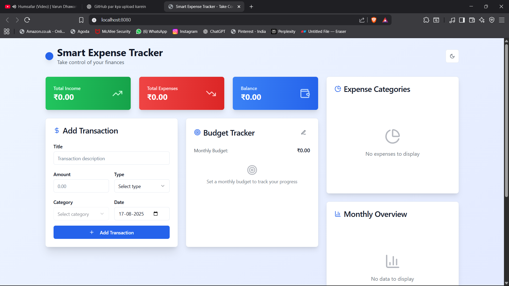

<div align="center">
  <h1>💰 Smart Expense Tracker</h1>
  <p>Track, manage, and optimize your finances with our intuitive expense tracking solution</p>
  
  [](https://opensource.org/licenses/MIT)
  [](https://www.typescriptlang.org/)
  [](https://reactjs.org/)
  [](https://vitejs.dev/)
  [](https://tailwindcss.com/)

  
</div>

## ✨ Features

- 📊 Visual expense tracking with interactive charts
- 📱 Responsive design that works on all devices
- 🔐 Secure data persistence with local storage
- 🎨 Beautiful UI built with shadcn/ui components
- ⚡ Blazing fast performance with Vite
- 🔄 Real-time expense updates and filtering
- 📱 PWA Support (Progressive Web App)
- 🌙 Dark/Light mode support

## 🚀 Quick Start

Get started with the Smart Expense Tracker in just a few simple steps:

```bash
# 1. Clone the repository
git clone https://github.com/yourusername/smart-expense-tracker.git

# 2. Navigate to the project directory
cd smart-expense-tracker

# 3. Install dependencies
npm install

# 4. Start the development server
npm run dev
```

Then open [http://localhost:5173](http://localhost:5173) in your browser to see the app in action!

## 📦 Built With

- [Vite](https://vitejs.dev/) - Next Generation Frontend Tooling
- [React](https://reactjs.org/) - A JavaScript library for building user interfaces
- [TypeScript](https://www.typescriptlang.org/) - TypeScript is a typed superset of JavaScript
- [shadcn/ui](https://ui.shadcn.com/) - Beautifully designed components
- [Tailwind CSS](https://tailwindcss.com/) - A utility-first CSS framework
- [Recharts](https://recharts.org/) - A composable charting library built on React components

## 🛠 Development

### Available Scripts

- `npm run dev` - Start the development server
- `npm run build` - Build for production
- `npm run preview` - Preview the production build
- `npm run lint` - Run ESLint
- `npm run format` - Format code with Prettier

## 🤝 Contributing

Contributions are what make the open source community such an amazing place to learn, inspire, and create. Any contributions you make are **greatly appreciated**.

1. Fork the Project
2. Create your Feature Branch (`git checkout -b feature/AmazingFeature`)
3. Commit your Changes (`git commit -m 'Add some AmazingFeature'`)
4. Push to the Branch (`git push origin feature/AmazingFeature`)
5. Open a Pull Request

## 📄 License

Distributed under the MIT License. See `LICENSE` for more information.

## 🙏 Acknowledgments

- [shadcn/ui](https://ui.shadcn.com/) for the beautiful components
- [Vite](https://vitejs.dev/) for the amazing development experience
- [Tailwind CSS](https://tailwindcss.com/) for the utility-first CSS
- [React Icons](https://react-icons.github.io/react-icons/) for the icons


Project Link: [https://github.com/yourusername/smart-expense-tracker](https://github.com/yourusername/smart-expense-tracker)
